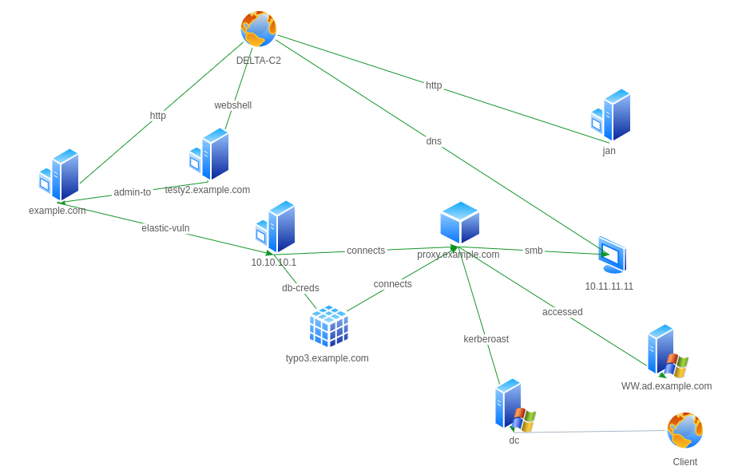

---
---

Medium Article

## Next level Documentation

You like Bloodhound ? You are performing red team audits or want more structure in your notes ?
Then this might be interesting: [LeL](https://editor.l3l.lol)

Currently in Beta version, however you should check it out: https://github.com/c-f

## What is LeL

Lel is a two component system. The backend is written in Go, the frontend is written in React.

The main purpose of LeL is to help structuring and visualize environments interactivly.

But lets start with a practical example:

- [Keepnote](https://github.com/mdrasmus/keepnote):
  - Old but gold (works pretty good)
  - Tree Structure possible
  * Syncing is not easy and often messes with the data
- [Notable](https://github.com/notable/notable):
  - good tag search
  - looks quite nice
  * Not open source anymore
  * Node app :/
- Sublime/Code/Editor:
  - maintained plugins
  - markdown sync
  * missing structures
- [SwiftnessX](https://github.com/ehrishirajsharma/SwiftnessX):
  - good focus
  - todo list
  * Node app :/
  * only two layers are not enough

Why not combine all these ??

Related Articles:

- https://medium.com/airbnb-engineering/scaling-knowledge-at-airbnb-875d73eff091

- https://duo.com/labs/tech-notes/open-sourcing-journal-how-labs-keeps-notes

- https://www.bugcrowd.com/blog/the-importance-of-notes-session-tracking-bug-bounty-hunter-methodology/

- https://forum.hackthebox.eu/discussion/1421/note-keeping-tool

- https://www.willchatham.com/tech/what-note-taking-app-is-best-for-pwk-and-oscp/
